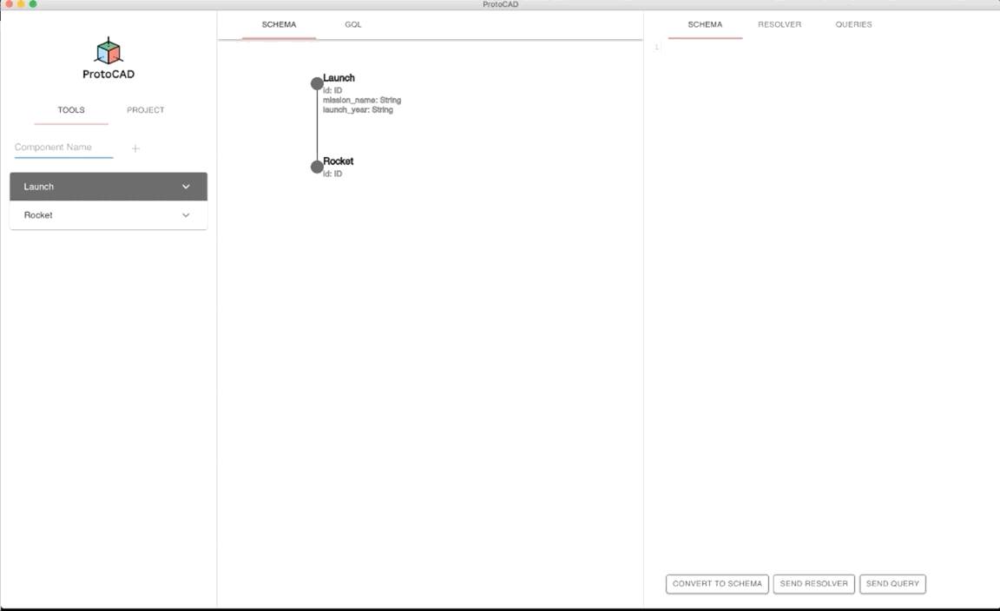

# ProtoCAD

ProtoCAD is a prototyping tool that empowers developers to build and visualize their component as GraphQL schemas and queries.


## Getting Started:
- Run Electron and Webpack in Development Mode
```bash
npm run dev
```
- Run tests
```bash
npm run test
```

## How to Use:
1. When the application starts, select the File tab from the menu and open a project of your choice. You would the find your all project files in the Project tab. To build components, click on Tools.

2. You can now see the components you built in a tree structure. Go ahead and add props to the components. The structure can be populated with several child nodes.


3. Let's convert the components to GraphQL Schema by clicking Convert to Schema Button. You can now see the components in SDL(Schema Definition Language).



4. Write GraphQL resolver and save it by clicking on the Send Resolver Button.


5. You could also write queries to request GraphQL server for data. Returned data is displayed under the GraphQL icon.


## Contributing
ProtoCAD is currently in beta release. We encourage you to submit issues for any bugs or ideas for enhancements. Also feel free to fork this repo and submit pull requests to contribute as well.

## LICENSE
[MIT](https://github.com/CAD-X/ProtoCAD/blob/master/LICENSE)

## Contributors

- Jason Lee | [@jasonlee1245](https://github.com/jasonlee1245)
- Kassandra Meyer | [@kassanj](https://github.com/kassanj)
- Benjamin Morrison | [@newbenhd](https://github.com/newbenhd)
- Eric Natividad | [@EricNatividad](https://github.com/EricNatividad)
- Suramya Sekhri | [@suramyasekhri](https://github.com/suramyasekhri)
